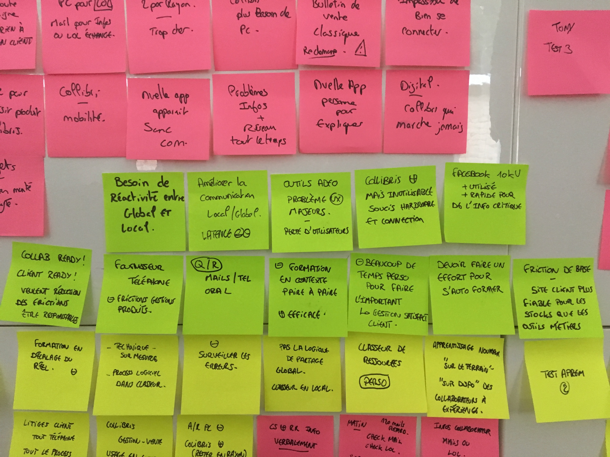

# Day 0 - Terrain

### Déroulé de la journée terrain

De manière à préparer au mieux nos 2 jours d'étude autour de la "digitale workplace" il était prioritaire de faire un état des lieux du "workplace" actuel. Bien entendu, il nous était impossible de visiter toutes les BUs et encore moins les différents pays et c'est pour cette raison que nous avons choisi d'utiliser des méthodologies anthropologiques permettant d'objectiver des résultats locaux de manière efficiente pour une utilisation globale lors de notre sprint.

Nous nous sommes donc rendus pendant un peu plus d'une matinée à la rencontre des collaborateurs directement dans un magasin Leroy Merlin à Lille. Fanny, notre anthropologue, dirigeait les interviews. La démarche est la plus naturelle possible : **s'introduire en expliquant que nous venons pour découvrir les problèmes de l'espace de travail, de manière à pousser une étude par la suite pour développer des solutions qui pourraient s'exprimer à l'aide du numérique.**

Nous avons pu échanger avec une dizaine de collaborateurs en prenant soin de bien les sélectionner afin d'avoir la plus grande diversité de profils possible. En effet, en partant d'une diversité locale large, il nous est possible d'objectiver des priorités communes.

#### Points prioritaires remontés

Suite à ces interviews, Fanny et moi-même, avons regroupé les différentes synthèses pour en extraire toute la matière à prioriser pour la présentation du lendemain :

* **Un besoin d'une plus grande réactivité entre le global et local**. En effet, les collaborateurs se sentent détachés de la centrale, impuissant lorsqu'ils veulent faire remonter leurs problématiques où même des solutions qu'ils voudraient dynamiser eux-même.
* Ce soucis vient en grande partie d'une communication lente avec des très grosses latences pour avoir des réponses \(des fois plusieurs mois pour une réponse, s'il y a une réponse\).
* Concernant le matériel et les logiciels de travail actuels, il y a des gros soucis d'ergonomie et d'usage, qui créent des frictions importantes. **Souvent les collaborateurs préfèrent revenir à l'échange oral et au papier.**
* Tous les collaborateurs aime le produit Colibris, cependant à cause de pannes fréquentes et de problèmes de connections réguliers, ils s'en détournent, ce qui crée une couche de frustration supplémentaire.
* Ils passent beaucoup de temps à échanger par téléphone avec les fournisseurs, **l'une des frictions majeure de leur quotidien : la gestion produit**. Les outils actuels sont moins efficaces qu'un échange téléphonique.
* Lorsqu'ils veulent s'informer sur ADEO, les nouveautés et ce qui les concerne, trop de frictions avec les canaux de com actuels.
* En conséquent, un groupe Facebook non officiel regroupe +10k collaborateurs et même des clients où des personnes extérieurs... Ils l'utilisent parce que c'est réactif, ils peuvent avoir des réponses, des retours, des échanges. \(+ rapide même pour des informations critiques métiers\).
* **Les collaborateurs sont prêt à devenir acteurs !** Cependant, la multiplication des frictions lorsqu'ils veulent lancer des initiatives empêche cette dynamique.
* Lorsqu'ils veulent apprendre, avoir une réponse, pousser une idée, ils ont déjà la démarche de le faire à l'oral et entre pairs. Ils disent que l'oral est le plus efficace actuellement.
* **Ils utilisent beaucoup de leur temps personnel pour faire ce qu'ils disent "important et prioritaire" : gérer la satisfaction client.**
* Lorsqu'ils veulent s'auto-former, c'est "un effort" pour eux, car cela doit être fait sur un temps autre que celui du travail mais surtout via des outils non ergonomiques et pratiques, ce qui demande un effort.
* Le site Leroy Merlin client est plus fiable que les outils pro concernant la gestion des produits et stocks.

### Point de vue Design

Tous ces retours se compilent avec les études plus larges que nous avons mené lors de notre premier sprint autour de la culture digitale. Ils se recoupent également avec des études globales sur l'évolution des attentes et usages dans le retail. C'est un exemple local qui confirme des tendances globales. **Le collaborateur souhaite se dynamiser, devenir acteur dans l'accompagnement des projets de ses clients.** Cependant, il se retrouve ralenti par la multiplicité des outils numériques et leur manque de qualité et performance. Alors, il préfère retourner à l'humain et à l'oral pour éviter cet univers plus complexe et chronophage.

C'est ainsi qu'on se rend compte encore une fois de la différence entre "digital" et "culture digitale". **L'outil ou l'application comme le matériel n'est pas la solution, ce doit être un support**, une aide et un accompagnement à la vie du collaborateur qui lui voit déjà sa culture "digitalisée". En effet, il souhaite sortir d'une posture vendeur produit pour se tourner vers la collaboration, vers l'accompagnement, **et il tente déjà de le faire**. Cette dynamique vient du monde digital et infuse dans le monde physique. Cependant, dans l'état actuel de ADEO, les "workplaces" ne sont pas aidantes par le digital mais plutôt créatrices de frustrations.

### Point de vue anthropologique

_En complément de son point de vue, vous pourrez trouver tout le document de présentation déroulé lors du DAY 1._

En amont des deux jours de créativité, une phase exploratoire a été menée.

Il s’agissait de réaliser une immersion ethnographique, c’est-à-dire de se rendre dans un point de vente \(Leroy Merlin\) afin de réaliser des observations et de mener des interviews auprès des collaborateurs du groupe ADEO.

Un guide d’animation a été construit grâce aux documents transmis par ADEO et au précédent design sprint réalisé :

**GUIDE D’ANIMATION**

**Méthodologie :** Optimisation de la matinée d’immersion ethnographique par l’alternance d’interviews courtes \(10 min maximum par collaborateur\) et par l’observation des usages et des pratiques des collaborateurs sur le point de vente.

**Objectif d’une double méthode de recueil des données :**

·      Mettre en tension le déclaratif \(discours\) et ce que les gens font réellement \(observations\).

·      Identifier d’autres problématiques qui ne sont pas apparues dans le discours des collaborateurs.

·      Capitaliser sur les observations in situ afin d’enrichir les relances pendant les interviews.

·      Possibilité de faire réagir les collaborateurs en situations réelles.

**Matériel de terrain :**

·      Prise de notes manuscrites.

·      Enregistrement des échanges \(dictaphone\).

·      Photographies.

·      Mini séquences filmées \(si pertinence il y a\).

#### Speech d’introduction

_« Bonjour, je m’appelle x \(Fanny ou Fabrice\), je mène des recherches sur l’évolution des modes de vie et de la consommation. Je m’intéresse à tout ce qui évolue dans la société._

_Aujourd’hui, en lien avec votre entreprise, j’aimerai m’intéresser à vous et à votre magasin. L’objectif est de comprendre comment vous « vivez votre travail au quotidien », à la fois avec les clients, mais également avec vos collègues et même avec ADEO._

_Rassurez vous, il n’y a pas de bonnes ou de mauvaises réponses et tout est anonyme._

_Je vais vous poser des questions simples et rapides. L’enjeu est vraiment que vous me parliez de vous et de votre quotidien._

_Avant de commencer, avez vous des questions ? »_

#### Pour commencer, découverte de l’individu.

_« Pour commencer, peux tu me parler un peu de toi ? De ta vie et de ce que tu fais au magasin ? »_

**à Relances.**

·      Age

·      Situation famille

·      Ancienneté dans le groupe

·      Passion/Hobbies

·      Ton métier

#### Comprendre le rapport de l’individu avec Leroy Merlin et/ou Adeo.

1. « Si tu devais me décrire brièvement la particularité de Leroy Merlin, que pourrai tu me dire ? »

**à Relances.**

·      Pourquoi ?

·      Comment te positionnes tu par rapport à cela ?

·      Qu’est ce qui est le plus important pour toi ?

#### 2. « Tu viens de me parler de Leroy Merlin, mais que peux tu me dire concernant Adeo ? »

**à Relances.**

·      Comprendre le lien spontané que l’individu fait entre Adeo et Leroy Merlin.

·      Creuser pour objectiver toutes les relations ou les interdépendances que l’individu connaît entre Adeo et Leroy Merlin.

·      Pousser la discussion jusqu’aux autres marques de l’enseigne \(France et international\).

#### Comprendre la place du digital dans la pratique métier de l’individu.

_« Comme je te l’ai dit, je m’intéresse à l’évolution des modes de vie. C’est pourquoi, j’aimerai que tu me parles de la place du digital dans ton quotidien au magasin …_

**3. Déjà pour toi, c’est quoi le digital chez Leroy Merlin ?**

**à Relances.**

·      Identifier les objets à sa disposition.

·      Identifier les outils et les interfaces.

·      Identifier les actions que l’individu met en place.

·      Identifier les actions que son magasin ou Adeo ont mis en place en lien avec le digital.

·      Identifier les besoins ou les attentes \(exprimés ou latents de l’individu par rapport au digital\).

·      **Identifier la compréhension de la stratégie digitale pour l’individu au niveau de l’expérience client, comme au niveau de sa pratique professionnelle mais également de son parcours pro de manière plus générale.**

4. Et dans ta vie perso, c’est quoi le digital ?

**à Relances.**

·      Identifier le niveau d’équipement de l’individu.

·      Identifier le niveau de compétences de l’individu.

·      Identifier les différentes applications que l’individu utilise.

5. Parfois, est ce que des liens sont faits entre ta vie pro et perso vis à vis du digital ?

**à Relances.**

·      Portable perso sur point de vente.

·      Applications ou comptes perso à finalités professionnelles.

·      Interactions avec les collègues ou des professionnels.

·      Interactions avec les clients ou internautes.

6. Pour toi, qu’est ce que le digital a changé dans ton quotidien au magasin ? Ou à l’inverse, qu’est ce qu’il devrait changer ? »

**à Relances.**

·      Gestes métier.

·      Temps.

·      Compétences.

·      Travail d’équipes.

·      Relation client.

·      Stocks, approvisionnement, commande.

·      Si tu avais une baguette magique…

·      Freins, tensions identifiées, …

Approfondissement \(si points non abordés durant la discussion\).

« 7. D’après toi, que veux dire être « commerçant » quand on travaille chez Leroy Merlin ? »

**à Relances.**

·      Partage dans le métier

·      Avec les pros, avec les particuliers

·      Accompagnement des collaborateurs, des clients

·      L’expertise en magasin

« 8. Face à tous les changements de modes de vie, comment vous vous êtes réorganisés pour répondre mieux aux attentes de vos clients ? »

**à Relances.**

·      Le groupe et les différentes marques

·      Sites Internet

·      Livraison

·      L’organisation du faire au quotidien

·      …

« 9. Quelles sont les initiatives que tu fais afin d’améliorer la vie de ton magasin, l’expérience de tes clients en magasin ou la réussite de leurs projets ? »

**à Relances.**

·      Typologies d’initiatives.

·      Positions de l’équipe \(collaborateurs + managers\) par rapport à ces initiatives.

·      Réactions des clients.

·      …

« 10. Aujourd’hui, as tu des feedbacks sur les projets réalisés de tes clients ? »

**à Relances.**

·      Pourquoi ?

·      Quels types de feedbacks ?

·      Via quels moyens ?

« 11. Dans un monde idéal, de quoi aurais tu besoin dans ton quotidien au magasin pour améliorer tes conditions de travail et l’expérience en magasin de tes clients ? »

#### Conclusion.

« Un grand merci d’avoir répondu parfaitement à toutes mes questions. Je reste toute la matinée. N’hésite pas à revenir vers moi si une autre idée te vient à l’esprit. Idem, si tu penses à me montrer quelque chose en magasin qui permet d’illustrer ce que l’on s’est dit. N’hésite pas ! Encore merci ! »

Cette demi-journée a donné lieu à une séance de brainstorming, puis de synthèse des résultats \(ppt pj\).

L’approche mobilisée, relative à la sociologie des usages a permis de mettre en tension le concept de « digital workplace » au prisme des outils à disposition des collaborateurs en points de vente.

De nombreuses verbatims sont apparues au cours des entretiens réalisés qui ont permis de réaliser une typologie des différents outils et pratiques associées :

**Colibri** :

-       Point négatif : problème de lenteur de connexion Internet, lenteur des actions, produit qui s’éteint, nouvelles fonctionnalités inconnues, mise à jour non annoncées, problèmes de scan, pas d’appareil pour chaque collaborateur, formation au sein des équipes \(déperdition de connaissances, formation non optimum\), écart entre les compétences digitales entre les collaborateurs, pertinence à géométrie variable en fonction des zones du magasin, trop cher d’équiper tout le monde.

-       Point positif : limitation du papier, accès à des informations rapidement, moins de déplacements dans le magasin, plus besoin de PC avec ca à terme.

Apprentissage par tâtonnement quand il y a du temps.

Outil top mais qui bug tout le temps.

**Matériel à disposition :**

-       Ordinateur :

o   LOL \(Support le plus sollicité\)

·      Point positif: Groupes de discussion spécifique \(différentes échelles\), Remontée d’information et de problèmes, Utilisation quasi quotidienne de la plateforme

·      Point négatif: Lenteur de l’interface \(même pour une photo\), Non ergonomie et fluidité d’expérience, Suppression des notifications car sous l’eau, Se connecter pour savoir si il y a eu une réponse, Réponses restent souvent sans réponses

o   Eureka: Juste cité une fois sans savoir expliqué

o    Outlook: Gestion des emails quotidienne, sinon on est submergé, Echange par emails avec des clients \(litiges le plus souvent\), Echange par emails avec les fournisseurs, artisans, Echange par emails avec les chefs de produits, SPAM des notifications

o   Pyxys: Outil du quotidien, Recherche compliquée par le numéro commande et pas par le client, Répétition des tâches : 15% à chaque références, plusieurs commandes, plusieurs tests : le digital empêche les arrangement = processus trop rigide par rapport à la réalité des pratiques

o    Numa \(Peu de formations réalisées\): Pas envie, Manque de temps, Formation qui ne colle pas aux problématiques terrain, Manque de nouveautés pour les personnes qui sont depuis longtemps sur le poste, Formation entre collègues, Refus de formation « officielle » par des collaborateurs

* Différentes possibilités de les réaliser

·      Sur l’ordinateur du magasin

·      Sur l’ordinateur du haut

·      Sur le téléphone portable perso en « tutos simplifiés »

·      Demander de l’information comme on peut pour avoir une réponse plutôt que de faire de la formation

·      Recherche emploi pour toutes les enseignes du groupe possible

* Concernant les les usages du téléphone:

-       Téléphone pro :

o   Pour joindre les fournisseurs

o   Pour joindre les artisans

o   Pour joindre les clients pour des litiges

o   Pour joindre d’autres magasins.

o   Pour joindre le chef de secteur.

o   Pour joindre le chef de produit.

* Un téléphone par pôle
* Personne difficilement joignable
* Basculement entre plusieurs interlocuteurs

-       Téléphone portable perso :

o   Pour discuter avec les membres de l’équipe.

o   Pour échanger par sms avec les artisans.

o   Pour aller sur la page facebook Leroy Merlin du magasin

* Personnes dédiées dans le magasin
* Challenge
*  Nouveauté
* Se tenir au courant

o   Pour aller sur la page facebook : tu sais que tu as bossé à Leroy Merlin, quand  \(détail dans la synthèse en PJ\)

-       Téléphone portable des clients :

o   Pour apprendre au client à se servir de l’application.

o   Pour voir les stocks disponibles d’un produit que le client a vu sur le site Internet.

La récolte des données a ainsi identifié un certain nombre de freins énoncés directement par les individus. Ces freins permettent d’objectiver des contraintes vécues et/ou perçues par les collaborateurs mais également d’identifier des opportunités d’innovation \(mobilisation du téléphone portable personnel, utilisation de What’s app, création de groupes Facebook non officiels\) ; tout en objectivant les stratégies de contournement et d’ajustement déployées par les collaborateurs pour optimiser leurs gestes métier, leurs relations clients.

L’ensemble de ces usages et de ces représentations représentent le socle actuel de la « digital workplace » d’ADEO et les prémisses des relations phygitales, nécessaires à la création d’une culture digitale.

