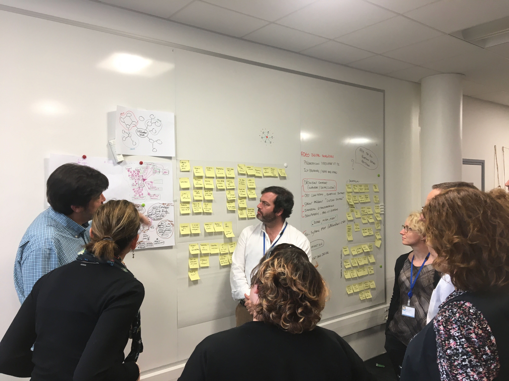
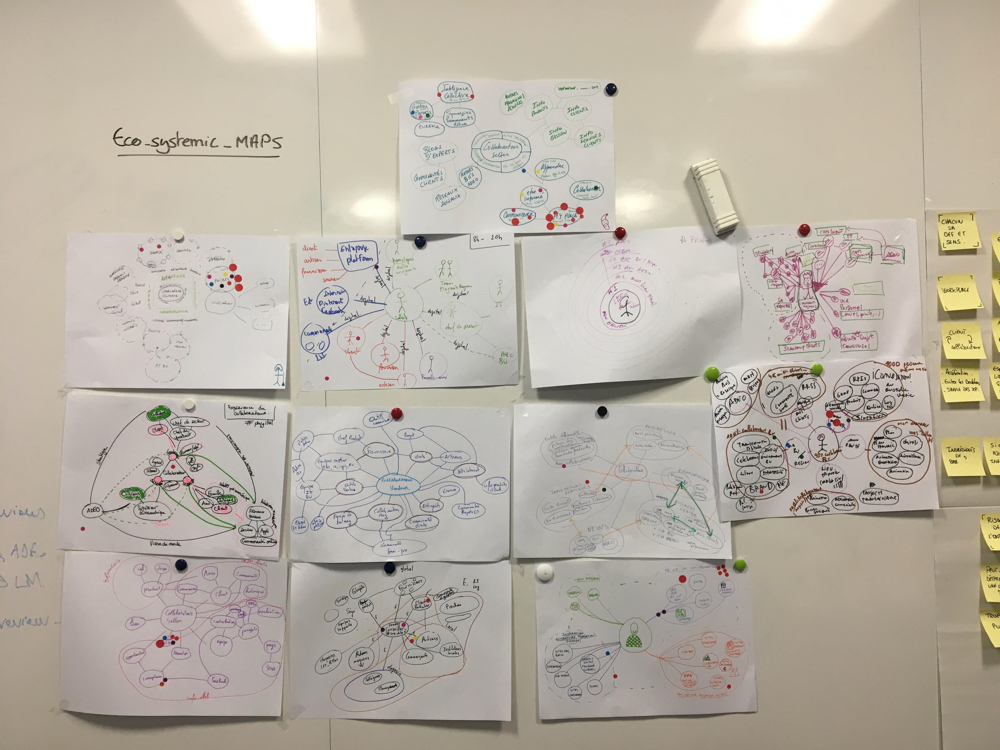
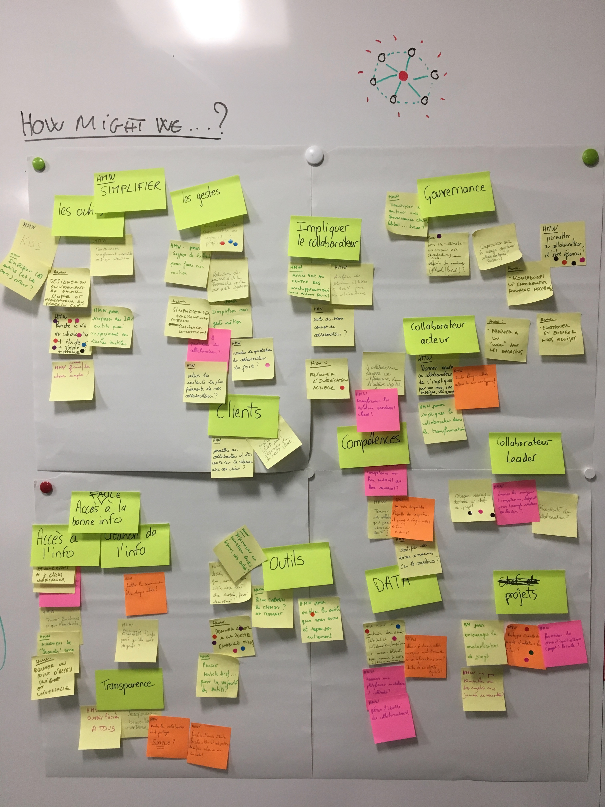
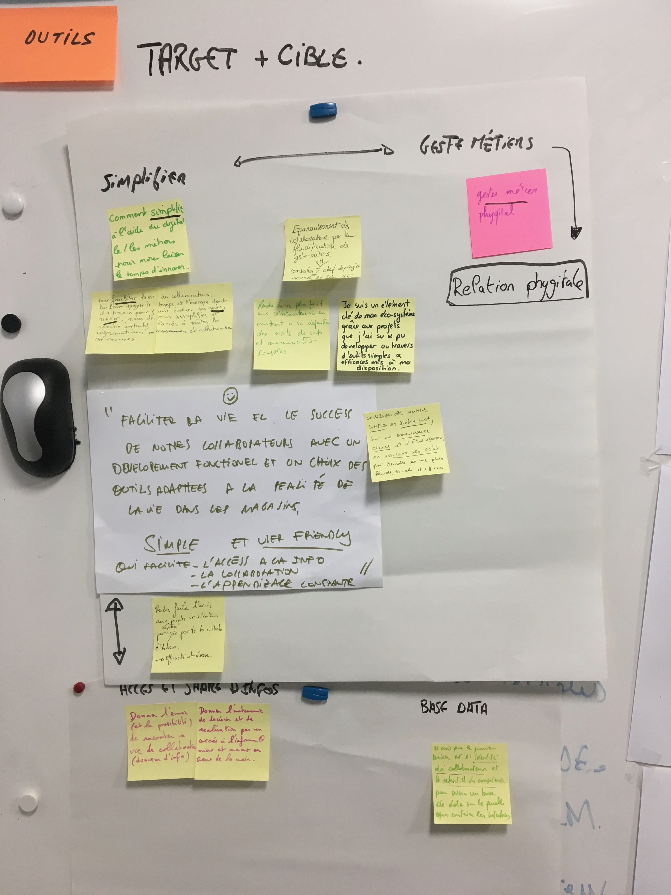

# Day 1 - Comprendre

### Plan de la journée {#plan-de-la-journee}

* Présentation des participants et du mini sprint
* Ce qu’il va se passer pendant ces 2 jours
* Ice Breaker / Hopes and Fears
* Définition commune des terminologies clés du challenge \(Workspace ? Digital ? Culture digitale ?\)
* Définir l’objectif ADEO long terme, les questions du Sprint et ce à quoi nous devons répondre durant ces 2 jours
* Utilisation des apprentissages du sprint précédent, "culture digitale"
* Informations immersion ethnographique
* Benchmarks - Adeo et externe \(Decathlon\)
  * _Repas & Pause_
* Eco-systemic map - **Collaborateur** _**in store**_ **centric**.
* Ask the experts \(rencontre avec 3 collaborateurs _in store\)_
* How might we notes \(durant les interviews\)
* HMW Regroupement et vote
* HMW + Map / Détecter les priorités et le target

_Ce sprint de 2 jours est un peu particulier pour un sujet aussi macro que "digital workplace". En effet, déjà qu'il est très court, il y a beaucoup de mouvement dans l'équipe du sprint avec des arrivés en cours et pas mal de départ en fin de première journée._

Tout le défi était d'arriver à créer et maintenir une dynamique commune, tout en favorisant l'expression de tout le monde pour profiter de la diversité présente.

Première phase commune et à l'oral pour construire une vision commune de ce qu'est le "digital workplace" : en effet, il y a autant d'interprétations possibles que d'évolution de ce concept très prisé dans les stratégies de transformation du moment. Commencer par s'aligner sur ce qu'est la vision d'un "workplace digital ADEO" est alors une priorité nécessaire.

En face de cette compréhension, placer les autres paramètres de contexte : la stratégie ADEO moyen et long terme, mais aussi l'état actuel "workplace" et l'état actuel du "digital et numérique" chez ADEO.

**Pour apporter ces éléments, plusieurs phases :** une présentation du sprint précédent, un rappel de la stratégie globale ADEO ainsi que les retours de Fanny sur l'étude terrain en DAY 0.

Aussi, pour compléter et comme lors d'un Design sprint plus classique, nous avions la présence de la porteuse de projet de la transformation digitale chez DECATHLON. Elle a pu nous présenter l'historique des transformations, l'évolution de la vision, la stratégie et l'état actuel. DECATHLON a beaucoup évolué grâce à la mise en place de solutions numériques non centralisées sous une seule et même plateforme. Ils créent tout un éco-systèmes de plateformes numérique liées entre-elles en terme de Data et de logique d'usage. C'est une recherche de cohérence, de collaboration et d'évolution qui est en cours chez eux. Une plateforme emploi, une plateforme profile des collaborateurs et une plateforme projets, le tout liés entre eux pour naviguer de manière fluide et logique. Derrière, l'utilisation de technologies du type web sémantique, permettent de lier des éléments de bases de donnés communes pour tous les produits en contact direct avec les collaborateurs.

_**Exemple :** Le collaborateur créé sa fiche perso. Il renseigne qu'il sait faire du graphisme et ainsi il peut trouver une collaboration sur un projet en rapport. S'il rejoint le projet, sa fiche profile sera visible sur la fiche projet, le tout lié sans que ce soit un nouvel élément. S'il modifie sa fiche profile, cela modifie sur l'ensemble de la plateforme. Sur sa fiche profile, automatiquement on peut voir maintenant qu'il fait partie d'un projet de création graphique. Tout est lié en terme de concept et d'information._

Concernant les éléments de stratégie, voir avec Nathalie. Concernant le document détail du sprint culture digitale [&gt; LIEN](https://designsprint.gitbook.io/adeo-culture-digitale/) - Concernant les retours de l'étude terrain, voir avec Fanny & Nathalie.

### Représenter le système ADEO

Cette phase de compréhension et d'alignement terminée, les participants se lancent individuellement dans la représentation de l'éco-système ADEO gravitant autour du collaborateur, placé au centre. En effet, dans les valeur de ADEO, l'humain doit être au centre. Ainsi, c'est le collaborateur en contact direct avec le client qui est placé au centre cette fois, le collaborateur "in-store".

Ce modèle de représentation systémique est très pertinent et important à conduire de manière individuelle : chaque participant peut découvrir comment les autres se représentent le système ADEO. Ils peuvent ainsi mieux comprendre leurs partenaires, car chacun a son propre modèle de pensée.

De plus, lorsque le cerveau humain visualise plusieurs systèmes différents qui doivent représenter la même chose, et suite à présentation et explication, il est capable de créer une "conscience" plus complète du système. Il ne saura pas forcément en "sortir" une version optimale sur un papier, cependant, il devient plus clair dans son esprit.

En partant de cette "conscience", ainsi que des éléments de compréhension précédents, chaque participant dispose de tous les ingrédients pour travailler autour d'un sujet avec efficience.

A l'aide des gommettes, je demande aux participants de faire remonter les parties des systèmes qui pour eux sont prioritaires : nous ajoutons ainsi une base de priorisation.

#### Les priorités remontées

* Un espace "my place" disponible au collaborateur. Un espace numérique personnel, où il peut se présenter comme il le souhaite et se rendre "visible" pour des projets, des interractions métier, etc...
* Un espace "projet" phygital, lui permettant d'accompagner au mieux ses clients ou collaborateurs qui deviennent des partenaires projets.

**Ainsi, le groupe comme tous les collaborateurs peuvent avoir une conscience de tous les membres de cette grande communauté ou chaque membre peut créer, rejoindre des projets et collaborer de manière libre et à hauteur de ce qu'il souhaite porter comme dynamique, autonomie et leadership.**

### How might we ?

Une conscience d'un système de manière très factuelle est très complémentaire avec la génération de multiples questions sous-jacentes à notre challenge initial très macro : **Comment construire l'environnement favorisant l'émergence du collaborateur leader ?**

C'est l'usage des **How Might We** : partir de toute la connaissance et compréhension générée par le groupe projet depuis le début de l'étude et créer des questions ouvertes de type "comment est-ce qu'on pourrait...?"

  
Cette génération de HMW fait remonter différents thèmes et axes. De la même manière que pour les maps, j'invite les participants à faire remonter leurs priorités grâce au "Zen voting" à base de gommettes.

#### Les priorités remontées

* Comment pourrait-on rendre la vie du collaborateur plus fluide, simple et efficace ?
* Comment pourrait-on permettre au collaborateur d'être épanoui ?
* Comment donner "l'outil à la poche" \(mobile first\) ?

### Synthèse de la journée

Normalement, une première journée de Design sprint déroulant sur 5 jours se termine avec la détection du point d'action "target" ainsi que de la "cible" liée. Nous avons la Map et nous avons les questions prioritaires, ce qui est le juste nécessaire pour l'exercice.

Cependant, pour faciliter l'expression personnelle de chacun, j'ai préféré inviter les participant à réfléchir de manière individuelle sur une synthèse personnelle. En effet, beaucoup partaient le lendemain, il me semblait primordial de leur donner l'occasion de synthétiser toute leur réflexion de la journée pour nourrir le reste du groupe pour le lendemain.

#### Ce qui ressort au final

Il faut simplifier la vie des collaborateurs, leurs outils, leurs méthodes et leur environnement de travail pour faciliter l'évolution de leurs gestes métiers. Ils entrent dans une ère de "relation phygitale" avec leurs clients/partenaires projet.

Pour ce faire, il faut leur donner accès à l'information et leur permettre de partager leurs expériences et connaissances aux autres collaborateurs.

**Accès à la connaissance &gt; Simplifier la vie collaborateur &gt; faciliter l'évolution du geste métier &gt; Relation phygitale projet client.**

Toute la partie technique et big data est nécessaire pour soutenir cette dynamique : il faut une infrastructure agile et évolutive pour permettre toutes les actions métiers et relationnelles.

## Point de vue facilitateur

C'était plutôt osé de ma part que de proposer une synthèse individuelle à chaque membre concernant un challenge aussi complexe. Je sais qu'il est toujours plus difficile de revenir à l'essentiel plutôt que de complexifier et c'est exactement ce qu'il c'est passé. Au lieu de fermer la journée sur une convergeance et décision du duo TARGET/CIBLE, j'ai choisi une expression de chacun qui a réouvert une divergeance plutôt que de recentrer. 

Cela laisse les participants avec une impression de flottement et de non accomplissement en fin de cette journée. L'effet "WOW" habituellement généré par cette dernière étape de journée ne s'est pas produit. 

C'était le risque à ajuster à ce point une démarche Design pour un sujet macro duquel il est très difficile de redescendre sur des actions et premiers pas concrets. Nous en revenons ainsi à la nécessité de l'humilité sur le respect des timing et phases de travail collaboratif.

Cependant, la matière générée était très intéressante pour une seule journée de collaboration. La seule frustration sera de ne pas avoir la présence de tous les participants du DAY 1 sur le DAY 2 : ils ne pourront malheureusement pas convertir la frustration du premier jour en accomplissement collectif du second jour par l'expérience directe. Espérons que ce document pourra combler et apporter un peu à leur absence.

## Point de vue Anthropologique 

Cette première journée de travaille a permis un partage de connaissances et d’expériences nécessaires à la compréhension et à la délimitation théorique de ce qu’est et devrait être la « digital workplace » pour ADEO. Ainsi, la stratégie et les ambitions d’ADEO ont été présentées, tout comme la synthèse du SPRINT « culture digitale ». A cette issue, une salariée de Décathlon est venue présenter un projet qu’elle a mené au sein de la « digitale workplace » de son entreprise. Son discours inspirant a permis de mettre un tension un certain nombre d’éléments importants à la bonne réussite d’un tel projet :

-       Embarquer les collaborateurs ;

-       Co-construction avec les parties prenantes ;

-       Interface simple qui reprend des outils déjà existants \(Linkedin, Search de Google\) ;

-       Briques technologiques qui permettent de faire remonter la même information à partir de plusieurs entrées ;

-       Décloisonnement des métiers « silos » au profit d’une valorisation du « faire ensemble » ;

-       Partage de bonnes pratiques entre les différents sites et visibilité des initiatives déjà réalisées ;

-       Fonctionnement en mode projet ;

-       Gestion des talents et des carrières, au-delà de la fiche de poste ;

-       Valoriser les dynamiques de mobilité et d’évolution internes ;

-       Favoriser les histoires « réelles » qui impactent la culture digitale des collaborateurs et des clients ;

-       Imposer une approche soutenable du retail ;

-       Approche test & learn ;

-       …

A cette présentation s’enchainait le retour de l’immersion ethnographique. Beaucoup moins inspirante, mais riche d’enseignements par rapport à la réalité des pratiques de terrain actuelles. Ce retour collaborateurs a eu plusieurs vertus :

-       Confronter les membres de la session à la réalité des remontées terrain ;

-       Objectiver l’écart entre l’expérience Décathlon et l’expérience des collaborateurs Leroy Merlin ;

-       Appuyer les injonctions paradoxales avec lesquelles les collaborateurs doivent composer au quotidien ;

-       Complexité et non fluidité de l’expérience collaborateur à cause du digital ;

-       Initiatives individuelles fortes ;

-       Esprit d’équipes ;

-       Disparité de niveau d’expertise et d’appétence par rapport au digital ;

-       …

Cette immersion a également permis de mettre en tension les retours d’expérience et les connaissances des membres de l’équipe en fonction des magasins, de leur position géographique ou de l’aire culturelle dans laquelle ils sont affectés. Ainsi, les problématiques semblent relativement similaires entre la France et le Portugal, par exemple.

- A la suite de l’incorporation de toutes ces informations, les participants ont pu débuter les différents exercices proposés par le facilitateur.

- 3 exercices ont pu faire émerger des informations pertinentes d’un point de vue anthropologique concernant la représentation que peuvent avoir les collaborateurs des problématiques concrètes tout comme de leurs espérances par rapport aux problématiques de la « digitale workplace ».

·      Ice Breaker / Hopes and Fears

Différents éléments sont apparus de manière récurrente auprès des différents participants :

-       Approche centrée utilisateur ;

-       Co-construction ;

-       Utilité de la démarche ;

-       Mise en place d’actions concrètes ;

-       …

Il est intéressant de noter que les éléments  énoncés par les collaborateurs renvoient à des typologies sous-jacentes communes et peuvent être à la fois perçues comme positives et négatives.

·      Eco-systemic map - **Collaborateur** in store **centric**.

Cet exercice a permis de mettre en exergue la différence de perception du système organisationnel et interactionnel entre les différents membres du groupe. Ce mapping, collaborateur in store centric engendre un décentrement pour sa réalisation par rapport aux postes occupés par les membres du SPRINT.

Différentes priorités sont apparues :

* Un espace « profil » ou « talent » disponible au collaborateur. Il s’agit d’un espace numérique personnel, où il peut se présenter comme il le souhaite et se rendre "visible" pour des projets, des interactions métier, etc... ; suivant un principe similaire à celui présenté par Décathlon.
* Un espace « projet » phygital, qui doit lui permettre d'accompagner au mieux ses clients ou collaborateurs qui deviennent des partenaires projets.

De manière sous-jacente, la notion de projet est très présente. On pourrait formuler ainsi une problématique de travail qui vise à construire cet « digital workplace » : comment faire en sorte que chaque collaborateur devienne « chef de projet » grâce au phygital ?

·      Détecter les priorités et le target

A l’issue de cette journée et des différentes phases de travail, il a été demandé aux participants d’identifier des priorités sur lesquelles axer leurs travaux. Grâce à l’exercice How might we ?, différentes catégories ont été décelées par les participants, elles reprennent les points les plus importants \(rendre le travail, plus simple, plus fluide et plus efficace pour le collaborateur ; bien-être collaborateur ; mobile first\). De ce travail émerge une question : **comment construire l'environnement favorisant l'émergence du collaborateur leader ?**

**Bilan de cette journée :** la tâche qui incombait au facilitateur n’était pas aisée. En adaptant les méthodologies d’un SPRINT aux contraintes des participants \(2 jours au lieu de 5 jours\) et en condensant au maximum les exercices sur la première journée \(beaucoup de participants absents le deuxième jour\) ; nous avons observé un flottement à la fin de cette première journée. En effet, certains participants semblaient dubitatifs quand à la pertinence de la production de la journée. De plus, ils doutaient de la réelle pertinence du bilan à mi-parcours ; renouant avec les craintes du début de matinée : _« faire une nouvelle méthode post-it, qui ne donnera rien au final »._

D’un point de vue anthropologique, on observe l’importance pour le collaborateur de s’immerger dans la totalité du SPRINT et d’accepter de faire confiance à la méthode. C’est précisément le « lâcher prise » produit par le format de cette méthode qui permet d’être innovant à travers la convergence rendu possible par la divergence et la réalisation de différents exercice qui amène chaque collaborateur à ce décentrer, à faire des pas de côté et surtout à faire consensus sans s’en apercevoir.

**Etre innovant, c’est aussi s’autoriser à ne pas tout maitriser !**

