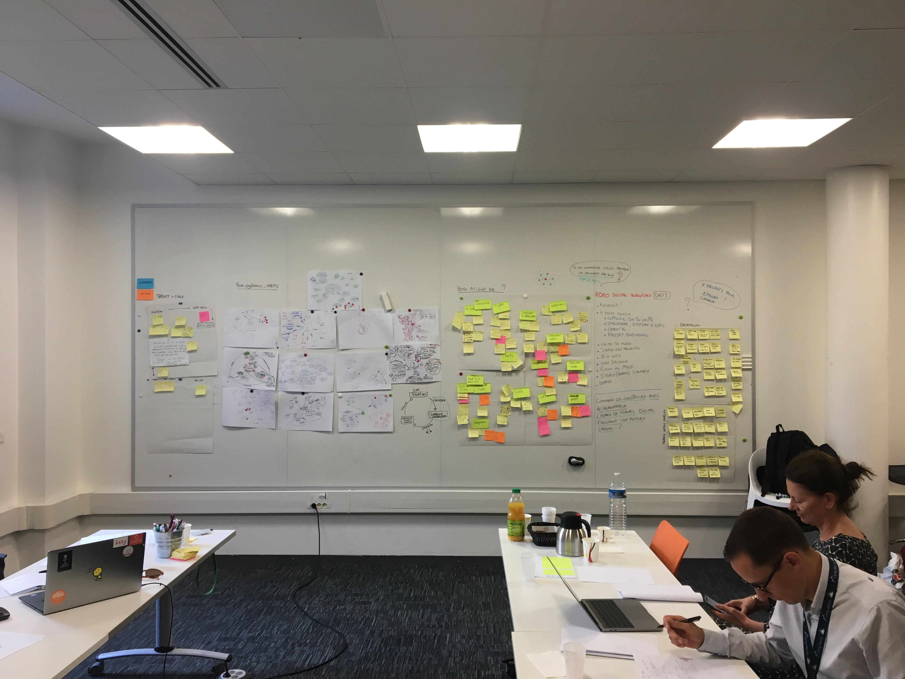

# Take to Go

### Un complément au sprint "culture digitale"

La "**digital workplace**" est l'environnement dans lequel s'exprime la "culture digitale". Cet environnement est lui-même constitué par cette culture. Ce sprint a permis d'affiner un axe clé de la "culture digitale" en proposant une analyse complémentaire : **explorer l'environnement en parallèle de la culture.**

_Les 2 sprints sont complémentaires pour construire le protocole "nouvelle génération geste métier"._

## Des principes pour construire par l'action une culture ADEO forte

_Reprise des éléments de la synthèse de Nathalie._

**Adeo s'engage à :**

* Offrir une voix digitale et les moyens d'accès au digital à chaque collaborateur
* Garantir la transparence des informations
* Garantir l'accès aux projets locaux, communs et globaux
* Permettre d'être acteur en contribuant et initiant des projets
* Permettre à chaque collaborateur d'être responsable de ses informations numériques et de son parcours
* Améliorer de manière itérative en suivant des feedbacks continues
* Mettre à disposition des outils simples et Mobile first
* L'environnement est ouvert sur l'éco-système
* Tout repose sur une architecture et infrastructure agile

### Actions pas à pas

Les premiers pas sont exposés : 

* Créer un référentiel collaborateur ouvert et transparent
* Permettre à chacun de visualiser l'ensemble des projets et initiatives ADEO
* Travailler main dans la main avec tous les collaborateurs, passant par **une communication continue et un échange local &gt; commun &lt; global accessible à tous**.

### Du côté des experts

Suite au Design sprint culture digitale et à ce sprint digital workplace, il semble clair maintenant d'envisager, pas à pas, les actions concrètes suivantes : 

* Tout émerge du terrain, d'un premier point local qui va faire remonter les feedbacks utiles à résoudre les problèmes locaux mais également à nourrir la connaissance commune, qui elle-même fera évoluer la culture globale.
* **Local=Action - Commun=Connaissance - Global=Culture.**
* D'un point de vue anthropologique, l'évolution d'une culture n'est pas descendante, surtout pas une culture digitale. La culture est nourrie par la connaissance partagée en commun, cette connaissance vient des actions locales. **C'est donc par le local qu'il faut commencer une transformation.**

**Pour ce faire, il faut choisir un premier terrain d'action.** Se "connecter" physiquement à ce terrain et en faire remonter les problématiques à l'aide d'interviews, d'observations construites avec des experts, les collaborateurs et les équipes stratégiques ADEO. Ensuite, il faut co-construire le "Design" du nouveau terrain, qui sera l'expression de la "culture digitale" représentant la "digital workplace ADEO". Mettre en place avec les collaborateurs ce "Design" dont ils seront les acteurs au quotidien, par leurs initiatives mais aussi par leurs feedbacks.

**En parralèle, il faut une équipe regroupant les feedbacks des actions locales** pour nourrir la connaissance en commun et la mettre à disposition de tous et en toute transparence. Pour permettre ce travail, **il leur faut une infrastructure numérique et des méthodes agiles ainsi que des expertises complémentaires.** Toute cette connaissance mise à disposition, permettra à tous les terrains locaux de s'en nourrir, comme base à leur propre transformation.

**En parralèle, il faut une équipe stratégique pour analyser et traduire** toutes ces actions, évolutions et communications venant du terrain et passant par le commun. De ces analyses pourra naître une "conscience" et compréhension de l'évolution de la culture ADEO. Cette "conscience globale", partagée en commun donnera un "savoir" nécessaire à faire évoluer, via des itérations continues, les différents terrains.

Les terrains qui seront dorénavant en action, pourront en continue se nourrirent d'une conscience globale et des connaissances communes. **Ce sont ces allers-retours, ce mouvement qui SERA la transformation de ADEO.** Cette transformation n'a pas de fin car c'est un mouvement continu vers l'avant, en constante observation et ajustement. **C'est une entreprise agile portant 100 000 leaders acteurs et conscients, qui pourra s'exprimer sur le long terme.**

## 🚀 L'accompagnement des experts

Que ce soit Fabrice et son expertise Design et méthodologique collaborative et systémique, comme Fanny et sa science anthropologique, ou encore Hugo et son savoir de la culture digitale et sa veille sur l'évolution de la société, c'est 3 experts "de base" peuvent accompagner ADEO dans l'évolution de sa transformation :

* Travailler avec Adeo sur le premier Terrain d'action et de transformation : interviews, observations, design et système de feedbacks.
* Travailler avec les équipes de l'infrastructure du commun pour le traitement des feedbacks, la logique de structuration de l'information et d'accès à tous les terrains.
* Travailler avec la stratégie globale pour mettre au clair cette "data d'actions et de connaissances", en créant une conscience et compréhension à mettre en parralèle avec l'évolution de la culture en dehors de Adeo, pour toujours pouvoir réagir et créer cette "conscience pour tous".

**Ce ne sera bien entendu pas seulement ces 3 experts qui pourront accompagner cette dynamique d'évolution.** Ils se positionnent surtout comme des "ponts" entre les collaborateurs "acteurs" de ADEO et des "acteurs" extérieurs, que ce soit des designers, des data analysts, des scientifiques \(en sciences humaines et en sciences du vivant\), etc... En effet, et suivant l'évolution de notre culture mondiale, ils travaillent en collaborations constantes avec de multi-éco-systèmes, que ce soit en France ou ailleurs.

Il peuvent faire le pont des connaissances, des outils, des expertises, des méthodes, tout en mettant en actions les collaborateurs Adeo avec l'extérieur et directement sur les différents terrains.

**Adeo a ses local&gt;commun&lt;global. Le monde à l'extérieur aussi, et nos experts peuvent se positionner en local avec Adeo, faire le pont "commun" avec l'extérieur et amener le global "planète" à Adeo, grâce à leurs éco-systèmes d'experts et de connaissances.**

_Merci pour cette expérience, qui comme chaque sprint, marque le début de l'aventure ! 🚀_

## Anthropologiquement parlant....

Dans notre société tout comme chez ADEO, s’intéresser au digital ne signifie plus s’intéresser seulement aux outils. Dans un monde de globalisation des échanges, d’instantanéité du partage d’information ou chaque personne peut être qui il veut en version numérique ; imposer des outils ou des usages digitaux à des collaborateurs semblent déjà désuet. En effet, chaque collaborateur devient expert de son quotidien et d’un univers digital enchâssé dans l’univers physique. Tout se passe comme si chaque individu se bricole une nouvelle façon d’être et de travailler en fonction de l’évolution des outils qu’il a sa disposition ; sans imposition aucune.

La phase préliminaire de terrain témoigne de l’interdépendance entre vie privée/vie professionnelle, entre vie prénumérique/vie numérique, entre savoir profane/savoir expert amenant à positionner la vie des collaborateurs en magasin comme un véritable miroir de la société. **Chaque collaborateur peut alors être perçu comme un innovateur du quotidien qui a su capitaliser sur ses outils, ses connaissances et ses compétences afin d’améliorer la relation client et ses gestes métiers.** Comme les entretiens réalisés en témoigne, actuellement les outils mis à disposition par ADEO ne correspondent pas à la réalité du terrain et compliquent la vie des collaborateurs.

Comme observé et échangé lors des deux jours de travail, penser une « digital workplace » équivaut en définitif à penser une expérience phygitale pour chaque collaborateur ; c’est-à-dire une expérience inclusive qui capitalise sur le digital pour améliorer le quotidien de chaque collaborateur \(parcours salarié, gestes métier et interaction avec le client\). Il semble que la « digital workplace » ne puisse se penser que par son intégration dans la stratégie de « culture digitale » amorcée par le groupe ADEO. La première étant, d’un point de vue anthropologique, la composante de la seconde.

Les priorités et les valeurs identifiées en phase terminale de l’expérience témoignent la nécessité pour les collaborateurs de switcher entre « ancien monde » et « nouveau monde ». En effet, les notions primordiales identifiées représentent les fondamentaux sur lesquels reposent les modalités de faire dans une société de type plateforme. Dès lors, il convient de s’interroger sur le modèle de translation possible entre ces partis pris et leurs modes d’application dans une société comme ADEO.

D’un point de vue anthropologique, il semble nécessaire d’effectuer un travail de « traduction » ou de « médiation » afin de comprendre comment nous pouvons interpréter et intégrer ses valeurs au sein de la stratégie digitale du groupe ; engendrant la création d’expériences phygitales. Cette phase de reformulation va conduire à l’identification d’actions clefs et prioritaires à mettre en place. Actions à tester en mode expérimentale afin de comprendre les freins et les enjeux terrain de ces mises en place. Ces mises en place nécessitent l’arbitrage des outils mis à disposition des collaborateurs tout comme d’une communication claire sur les droits et les obligations de chaque collaborateur \(zones de flottements identifiés\).

**L’expérimentation en mode test & learn auprès d’un ou plusieurs magasins semblent nécessaire à la compréhension des enjeux du digital pour la mise en place d’une stratégie globale de « digital workplace »; amenant à lister les premières actions prioritaires à mettre en place:**

* Choix d'une zone d'expérimentation en local \(représentative d'un champ des possibles large\).
* Arbitrage sur les modes de récoltes de données-feedbacks \(quanti et quali\) et sur les priorités de remontées d'informations pour ADEO.
* Cadrage stratégique afin de déployer une méthodologie qui corresponde aux enjeux d'ADEO, permettant de traduire les priorités identifiées durant le SPRINT en actions concrètes.
* Partis pris forts: mobile first, actions spécifiques, etc.
* Démarrage de l'expérimentation: test & learn, co-construction.
* Capitalisation des retours d'expériences afin de bâtir une stratégie commune et déployer globalement la démarche.

En définitif, bâtir une culture digitale au sein d'ADEO semble possible par l'intermédiaire de la mise en place d'une "digital workplace" facilitante et bienveillante pour les salariés. Il est important de conserver à l'esprit les valeurs qui ont émergé pendant le SPRINT, rappelant un célèbre adage africain: **"il faut tout un village pour élever un enfant"**... Il en va de même pour la culture digitale d'ADEO: **une approche bottom-up et co-construire et garante de son acceptation et de sa réussite au sein du groupe.**  

