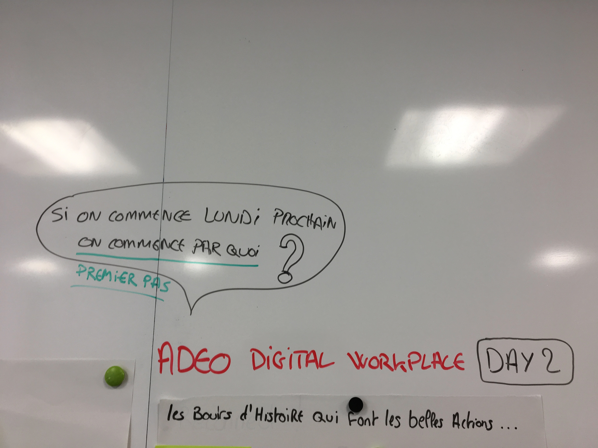
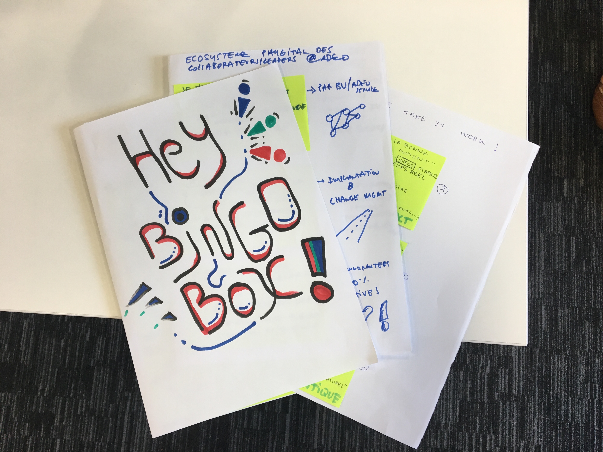
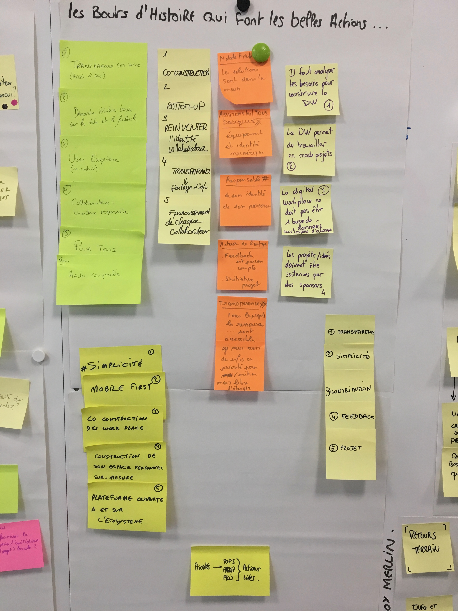

# Day 2 - Diverger/Converger

### Plan de la journée

* 4 steps sketch \(Créer son projet, step by step\)

  * Collecter les éléments de la veille \(ingrédients\)
  * Structurer ces éléments, créer un système d'idées \(recette\)
  * Crazy 8's
  * Structuration des idées et construction du projet individuel

  * _Repas & Pause_

* Visite du musée \(découverte des projets\)
* Construction d'une "carte des priorités"
* Big vote
* Vote du décideur
* Fusionner les projets ou les traiter indépendamment   
* Priorisation des "partis pris ADEO"
* Debriefing

## La journée

La redéfinition du challenge exacte émerge dès le début de la journée dans le but de le clarifier pour tous : **Comment Co-construire avec le collaborateur l’espace de travail digital facilitant une posture leader ?**

En partant de cette "direction commune", chaque participant va pouvoir développer de manière individuelle sa propre expression de solutions concrètes à mettre en place.

Quelques précisions apportées par Nathalie cependant pour clarifier par rapport aux attentes en fin de journée :

* C'est un atelier pour apporter des axes stratégiques plus précis, pour écrire et traduire la stratégie globale ADEO
* Il est ainsi nécessaire de faire émerger des "Partis pris" qui seront les grands principes ADEO autour de la "digitale workplace".
* Ce sont ces partis pris qui guideront les actions concrètes à mettre en place suite à cet atelier.

## Les projets individuels

L'objectif des projets et de redescendre sur les partis pris mais également des actions concrètes qui seront les premières étapes : en effet, pour tout projet, il faut bien commencer par pousser la première porte et le Design sprint est là pour aider à décider de la bonne porte à pousser, celle qui portera tout un projet le plus loin possible et dans les meilleures conditions.

Tous les participants, avec ces indications en tête, se sont lancés toute la matinée dans leur propre expression de réponse au challenge. A la fin, juste avant le repas, un des participants devait partir, mais pour profiter de son projet et de ses explications nous avons fait une phase de "mini musée", juste pour lui. Ainsi, nous avons remonté toute la compréhension, mais pas de vote, ce sera avec tous les autres projets l'après-midi, après une coupure repas nécessaire pour revenir avec un esprit plus détendu.

Au retour du repas, les participants découvrent les projets. Tranquillement au fil des projets, des alignements se font sur la compréhension des axes à développer. Il semble que naturellement des convergences se produisent, très peu de débat n'allait pas dans le même sens. Les projets confirment cette impression : **ils sont clairement tous complémentaires, regroupant chacun à sa manière les éléments prioritaires à mettre en place pour construire cette "digital workplace Adeo".**

Cependant, lors d'un sprint, impossible de tout prendre, il faut commencer par un axe ! Alors les participants votent, pour donner leurs priorités. Ils annoncent également leur vote unique, pour donner une granularité supplémentaire dans les priorités !

Cette fois, et contrairement à un Design sprint classique, pas de vote final décideur qui orienterait sur la création d'un prototype. **En effet, la synthèse de cette journée est différente, il nous faut les "principes ADEO", les partis pris qui vont guider le actions.**

Alors je demande à chaque participant, de manière individuelle et sur un temps très serré, de repasser sur les projets de chacun, de prendre en compte toutes les informations et priorités et de générer leur **TOP 5 Principes ADEO digital workplace**.

## TOP 5 Principes ADEO digital workplace

Nous regroupons les tops 5 de chacun en un temps record ! En effet, il nous reste moins de 20 minutes pour finir la journée, certains participants doivent partir...

Ce regroupement est la base de travail nécessaire à Nathalie pour écrire les principes ADEO. Elle y retrouve les priorités de chacun venant de leur spectre d'analyse mais surtout de leur synthèse personnelle de tout le travail de ces 2 jours.

C'est donc sur ce tableau l'essence de tout le travail collectif qui est exposé : la force des mots, la priorisation de chacun et également une priorisation globale :

* La transparence est le principe majeur.
* La simplicité, des outils, des applications et de tout l'éco-système numérique.
* Partir des feedback collaborateurs, pour co-construire des solutions avec eux plutôt que de construire pour eux sans les intégrer. \(logique bottom-up et Local-communs-global\).
* Le collaborateur est responsable de son identité et de sa dynamique.
* A toutes les échelles, il faut travailler en mode projet et collaboration.
* Il faut permettre l'accès au basique et à l'apprentissage à TOUS.

### Utilisation de ces éléments pour la suite

Voilà les principes majeurs ADEO qui ont émergé clairement. _Ces principes sont rédigés par Nathalie dans un autre document._

Ces principes sont directement reliés à des actions concrètes, directement expliquées et représentées sur les projets des participants. Ainsi la démarche pour lancer la dynamique est la suivante : 

* Les principes sont priorisés
* Les principes définissent les priorités d'actions liées à mettre en place
* Les actions sont déclenchées en mode projets, suivant la priorisation retenue.

Au cours du développement des actions, un lien fort reste entre la stratégie, le global et le terrain, par le commun. **Le commun, c'est cet espace de transparence de l'information, nourrit par les feedback terrain et le traitement fait de ces feedback par le global pour améliorer les solutions en local.**

**La mise en place même des éléments découverts lors de ce sprint doivent suivre les principes ADEO nouvellement exprimés. Cela crée une cohérence dès "le lundi prochain" :\)**

_Les projets sont regrouper dans un dossier fourni à Nathalie._

## Point de vue Facilitateur

C'est une belle journée, avec des concrétisations. En effet, je suis heureux de trouver dans les projets des éléments concrets, autant au niveau d'actions micros que de mise en place macro. **Le plus intéressant est la complémentarité des projets entre-eux**. En seulement 2 jours, avec beaucoup de mouvements de participants, le groupe a réussi à définir des axes prioritaires, à lier des principes à des actions concrètes et des actions prioritaires à une stratégie globale.

Chaque participant a pu s'exprimer et il y a eu très peu de débats contradictoires. Il règne déjà chez Adeo un fort esprit de convergence malgré les multiples explorations actuelles partant un peu dans tous les sens. Grâce à ces principes posés, les actions vont pouvoir se structurer de manière plus cohérente et permettre une transformation globale, pas après pas et qui se fera main dans la main avec les collaborateurs, en partant de leurs besoins métiers et personnels. **En effet, la frontière entre pro et perso dans un monde de "culture digitale" est de plus en plus fine...**

## Point de vue Anthropologique

La deuxième journée se déroulait en équipe restreinte. Dès le lancement de la journée, le facilitateur a proposé une reformulation de l’objectif de l’expérience aux différents membres du groupe afin de les aider dans leur nouvelle journée de travail : « **Comment co-construire avec le collaborateur l’espace de travail digital facilitant une posture leader ?**». Il a également demandé à chaque participant de garder à l’esprit l’opérationnalité des productions, à travers la question : « si on commence lundi prochain, on commence par quoi ? »

Cette journée fut dédiée à la réalisation et à la soumission de projets \(projets individuels, construction collective\). Le facilitateur a accompagné les membres du groupe dans un détour créatif afin de les amener à capitaliser sur les informations récoltées et identifiées la veille. Tout se passe comme si tout le travail de récolte avait déjà été fait et que les participants devaient exprimer, avec leur vision, une expression possible des informations en projets. Différents exercices se succèdent, entre travail individuel et partage collectif.

A cette étape, la démarche semble encore floue pour certains participants et l’issue incertaine. Ils peinent à s’embarquer dans la démarche et à suivre les consignes du facilitateur.

·      **Crazy 8’s**

Le recours à cet exercice marque un tournant dans l’expérience. Il a permis à chaque participant de plonger dans l’univers créatif espéré et d’amorcer un ordonnancement de ses idées pour le projet. Priorisation, intuition, conviction, … la représentation imagée et en temps restreint de leurs idées a engendré une bascule entre l’univers ultra-rationnel des participants et un champ des possibles où tout reste à faire.

A la suite de cet exercice, il a été demandé aux participants de formaliser les projets qu’ils avaient commencé à structurer au sein des phases précédentes. Le support de présentation final : une feuille A4 avec trois post-it qui représentent trois points de vue / étapes / slides, ou trois expressions du projet permet de structurer sa pensée et appelle à la clarté. Les consignes sont rappelées : produire un projet visuel et simple, qui doit être compris par tout le monde. Les dessins sont valorisés. Des points explicatifs peuvent être adjoints aux différentes pastilles représentées.

Avant l’heure du déjeuner, tous les membres ont terminé leurs projets et le facilitateur les récupèrent afin de les exposer en début d’après-midi.

A la fin de la pause déjeuner, chaque participant se trouve projeté dans l’univers d’un musée : les différents projets sont exposés et les participants doivent les observer, les déchiffrer, adjoindre des questions… Le tout en silence.

Puis, chaque participant se désigne pour présenter un projet en fonction de sa propre compréhension ; avant que le réalisateur du projet ne se désigne et s’attèle à réexpliquer ou à compléter les explications concernant la présentation de son projet. Cette phase est primordiale car elle permet une première confrontation du projet au collectif, tout en testant sa clarté et sa pertinence.

Ensuite, vient le temps des votes et des gommettes. Chaque participant doit choisir un nombre restreint d’éléments qu’ils jugent les plus pertinents dans l’ensemble des projets. Il vote en quelque sorte pour des points qu’ils jugent clefs pour la réussite du projet. Cet exercice oblige les participants à valoriser une approche pragmatique et micro des projets ; c’est à dire réalisable car factuelle.

Ce premier vote conditionne un second vote, au sein duquel les participants sont armés d’une gommette géante et où ils doivent voter pour l’élément qu’il juge le plus important dans tous les projets. Il s’agit d’une phase ardue dans le déroulé de l’expérience : cette dernière demi-journée est riche en échanges et les membres commencent à co-construire une vision commune de la « digital workplace » ; et comme choisir c’est renoncer, le choix semble cornélien pour les participants.

Malgré l’apparente difficulté de l’exercice, on note de grandes similitudes entre les différents projets réalisés : mise à disposition d’outils simples et opérationnels, création de briques technologiques afin de proposer une expérience collaborateur fluide, accompagnement des équipes, … Mettant en avant des priorités fortes : transparence, collaborateur centric, co-construction, mobile first, … Pour ne citer que les plus représentatives.

·      **Prioriser pour identifier les partis pris**

Cette deuxième journée se termine par l’identification des partis pris, représentant en quelque sorte les valeurs que chaque membre souhaite injecter dans la « digital workplace ». Valeurs représentant le socle du projet. Il est demandé à chaque participant de lister les 5 priorités et partis pris qu’il juge primordiaux pour les prochaines étapes du projet.

A travers une dernière séance post-it, chaque participant affiche et dans l’ordre les priorités qu’il a identifié et qui représentent en quelque sorte la synthèse des points les plus importants identifiés en phase précédente au sein des projets présentés :

* Transparence.
* Simplicité \(outil, usage\).
* Feedback collaborateur comme socle et point de départ de la démarche \(données quali et quanti\).
* Responsabilisation du collaborateur.
* Notion de projet au cœur de la démarche.
* Garantir l’accès et la connaissance aux basiques. 

  

